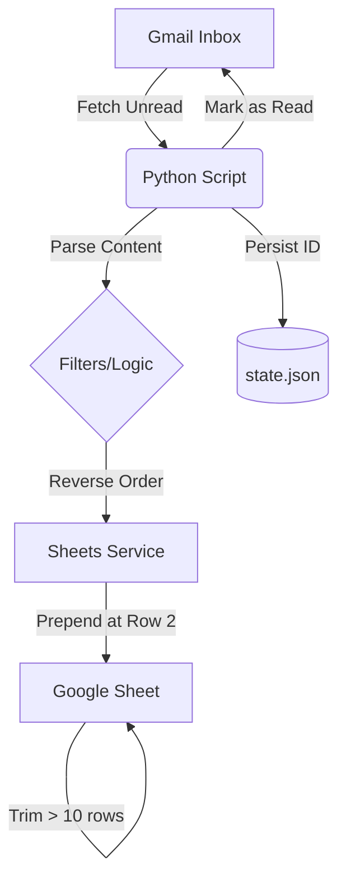

# Gmail to Google Sheets Automation

A robust Python automation system that fetches unread emails from Gmail and logs them into a Google Sheet in reverse-chronological order.

## 🏗️ High-Level Architecture



## 🚀 Setup Instructions

1.  **Clone the Repository**:
    ```bash
    git clone <repo-url>
    cd gmail-to-sheets
    ```

2.  **Install Dependencies**:
    ```bash
    python -m venv venv
    source venv/bin/activate  # Windows: .\venv\Scripts\activate
    pip install -r requirements.txt
    ```

3.  **Google Cloud Setup**:
    *   Enable **Gmail API** and **Google Sheets API** in the Google Cloud Console.
    *   Initialize the **OAuth Consent Screen**.
    *   Create **OAuth 2.0 Desktop Credentials** and download `credentials.json`.
    *   Place `credentials.json` inside the `credentials/` folder.

4.  **Configure**:
    *   Open `config.py` and set your `SPREADSHEET_ID`.

5.  **Run**:
    ```bash
    python src/main.py
    ```

## 🛠️ Technical Explanation

### OAuth 2.0 Flow
The system uses the **OAuth 2.0 Authorization Code Flow** for Desktop Apps. 
- On first run, it opens a browser for user consent.
- Upon approval, it receives an authorization code and exchanges it for **Access** and **Refresh** tokens.
- Tokens are persisted in `credentials/token.json` for subsequent silent authentication.

### Duplicate Prevention & State Persistence
To avoid logging the same email twice, the script uses a **state-based tracking system**:
- **Persistence**: Every processed `message_id` is stored in `state.json`.
- **Logic**: Before processing an email, the script checks if the ID exists in the local set loaded from `state.json`. If it exists, the email is skipped.
- **Safety**: IDs are added to the state *before* marking the email as read in Gmail, ensuring reliability.

## 🏆 Challenges Faced

**The "Ghost Table" Alignment Issue**:
During initial deployment, new data was being appended to Row 228 instead of Row 2, despite the sheet appearing empty. 
*   **Discovery**: Using the Sheets API metadata, I discovered a hidden "Table" object (`Applicant_Email_Log`) and "Banded Ranges" defined up to row 227. 
*   **Solution**: I developed a specialized cleanup logic that programmatically deleted the Table and BandedRange objects, reset the grid properties, and re-initialized the headers. This allowed the `prepend` logic to work perfectly at Row 2.

## ⚠️ Limitations
- **API Quotas**: Subject to Google's daily API rate limits.
- **Local Runtime**: Currently designed to run as a local script; requires a server/cron for 24/7 automation.
- **Single Sheet**: Configured specifically for 'Sheet1'.

## ✨ Optional & Bonus Features
- **[BONUS] Subject-Based Filtering**: Filter emails in `config.py` by defining `EMAIL_SUBJECT_FILTER`.
- **[BONUS] Logging**: Comprehensive logging in `app.log` and console.
- **[EXTRA] Latest-on-Top Sorting**: Every run inserts the newest email into Row 2 (immediately after headers).
- **[EXTRA] 10-Email Capacity**: The script automatically trims the sheet to keep only the 10 most recent entries.

## 👤 Author
**Sontara**
